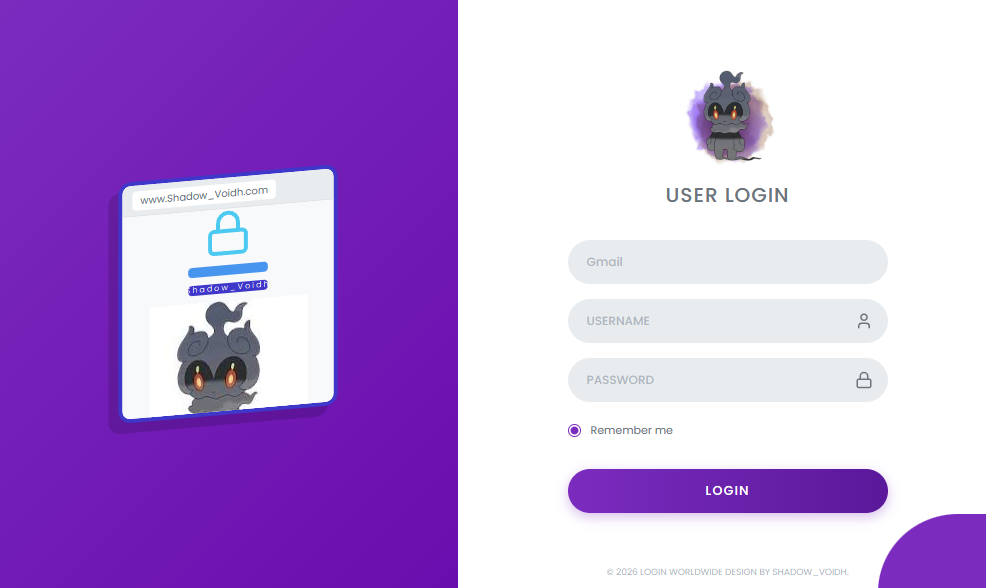
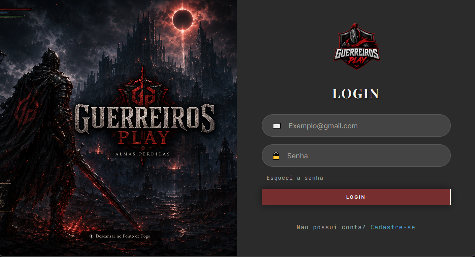
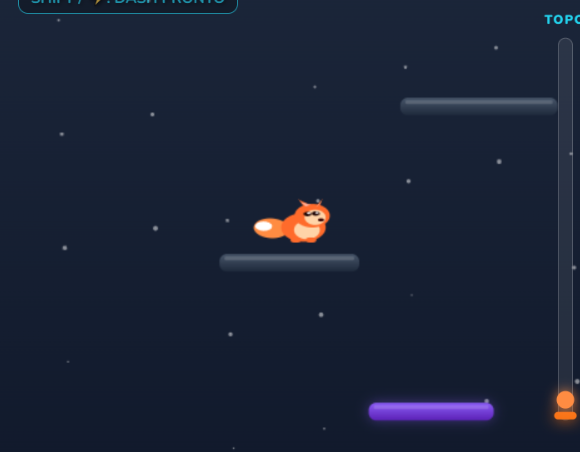
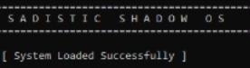

<h1 align="center">Meus Repositórios</h1>

 

<!-- ==================== CATEGORIA HTML ==================== -->

  

    <h2 style="display: inline;">
      
      Projetos HTML
      
    </h2>
  

   

  <table align="center" width="100%">
   <!-- BLOCO 1 (PROJETOS 1 E 2) -->
  <!-- LINHA 1: IMAGENS -->
    <tr>
      <td align="center" width="50%" valign="middle">
        
      </td>
      <td align="center" width="50%" valign="middle">
        
      </td>
    </tr>

   <!-- LINHA 2: TÍTULOS E DESCRIÇÕES -->
  <tr>
      <td align="center" valign="top">
        <h3>Index Ubers</h3>
        
<i>Estudo de Html e JS</i>

        
Aplicação web desenvolvida com o objetivo de consolidar conceitos avançados de estruturação com HTML5, estilização e layouts complexos com CSS3, e manipulação dinâmica de elementos via JavaScript.

      </td>
      <td align="center" valign="top">
        <h3>Tela de Login Simples</h3>
        
<i>Lógica de Login Simples</i>

        
Trabalho para Estudo de Login de Usuário com armazenamento de senha salvo localmente em JS.

      </td>
    </tr>

  <!-- LINHA 3: BADGES E BOTÕES -->
  <tr>
      <td align="center" valign="bottom">
        

          
          
          
        

        
      </td>
      <td align="center" valign="bottom">
        

          
          
          
        

        
      </td>
    </tr>

  <!-- BLOCO 2 (PROJETOS 3 E 4) -->
  <!-- LINHA 1: IMAGENS -->
   <tr>
      <td align="center" width="50%" valign="middle">
        
      </td>
      <td align="center" width="50%" valign="middle">
        
      </td>
    </tr>

  <!-- LINHA 2: TÍTULOS E DESCRIÇÕES -->
  <tr>
      <td align="center" valign="top">
        <h3>Trabalho de BackEnd & FrontEnd</h3>
        
<i>Site Simples</i>

        
Projeto Escolar de BackEnd com FrontEnd, um site simples de vendas (não funcionais).

      </td>
      <td align="center" valign="top">
        <h3>Fox Blaze Game</h3>
        
<i>Um Jogo Simples</i>

        
Um jogo de plataforma interativo desenvolvido utilizando JavaScript e HTML5.

      </td>
    </tr>

   <!-- LINHA 3: BADGES E BOTÕES -->
  <tr>
      <td align="center" valign="bottom">
        

          
          
          
          
        

        
      </td>
      <td align="center" valign="bottom">
        

          
          
          
        

        
      </td>
    </tr>
  </table>

 

<!-- ==================== CATEGORIA C++ ==================== -->

  

    <h2 style="display: inline;">
      
      Projetos C++
      
    </h2>
  

   

  <table align="center" width="100%">
    <!-- LINHA 1: IMAGENS -->
    <tr>
      <td align="center" width="50%" valign="middle">
        
      </td>
      <td align="center" width="50%" valign="middle">
        
      </td>
    </tr>

  <!-- LINHA 2: TÍTULOS E DESCRIÇÕES -->
  <tr>
      <td align="center" valign="top">
        <h3>Fusion Souls</h3>
        
<i>Desenvolvimento de Jogo em C++</i>

        
Projeto focado no desenvolvimento de mecânicas de jogo, orientação a objetos, lógica de combate e manipulação de estado utilizando C++.

      </td>
      <td align="center" valign="top">
        <h3>Sadistic Shadow OS</h3>
        
<i>Desenvolvimento de Kernel / Sistema Operacional</i>

        
Kernel customizado desenvolvido em C++ e Assembly, focado no entendimento de baixo nível, controle de memória, Bootloader e arquitetura de hardware.

      </td>
    </tr>

  <!-- LINHA 3: BADGES E BOTÕES -->
  <tr>
      <td align="center" valign="bottom">
        

          
        

        
      </td>
      <td align="center" valign="bottom">
        

          
          
        

        
      </td>
    </tr>
  </table>

